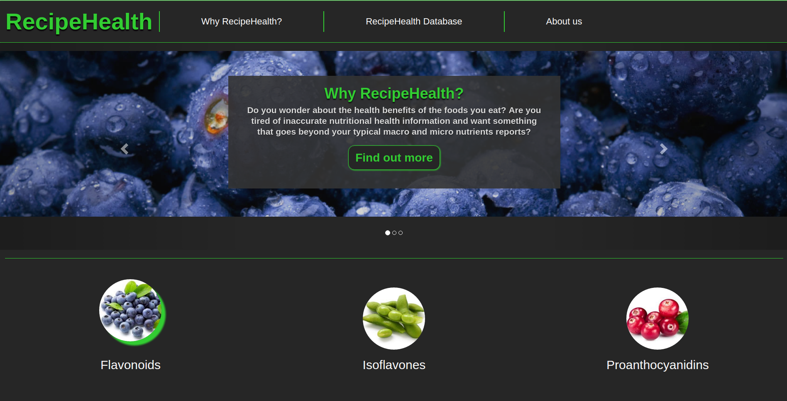
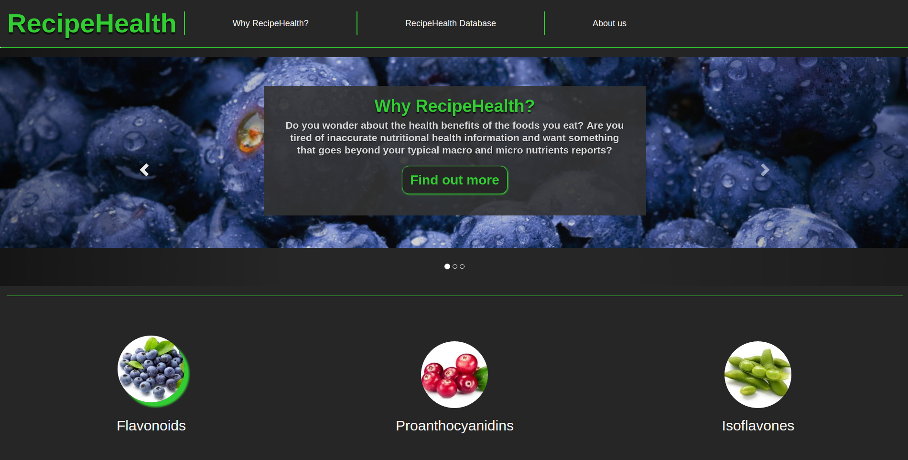
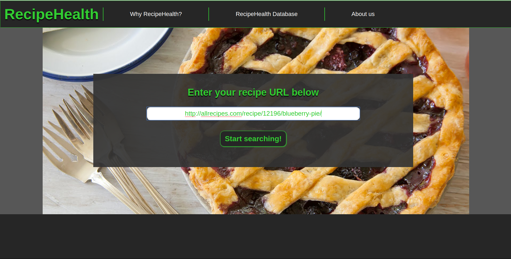
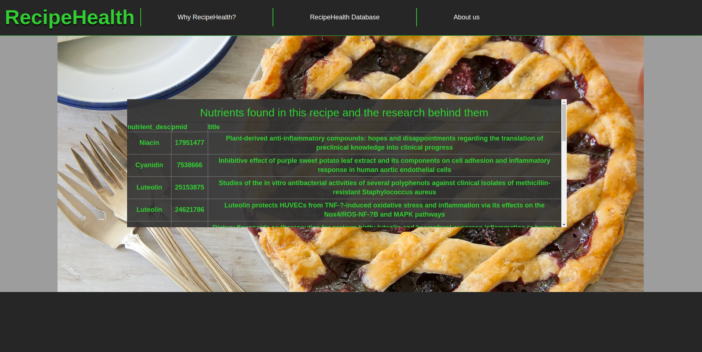

## RecipeHealth Web Application

## **Please see dev branch for most current code**
Web application built and deployed using Apache Maven and Tomcat that allows users to input a food recipe URL and receive detailed information for 60+ nutrients in the amounts specified in the recipe ingredients. The created PostgreSQL database connects the nutrients to medically backed research regarding human health and disease.

Uses: Java, JavaScript, HTML, CSS, and SQL 

Application uses RESTful architecture and client-server model to communicate between the browser side JavaScript/HTML and a PostgreSQL database using a Java servlet.

Natural Lanugage Processing difficulties were encountered and the project is on hold aside from front-end changes until a good direction is found to proceed in. 

**NOTICE -- work in progress...different directions can be taken **
**more documentation needs to be added **

**RecipeHealth**

	|--src/main/
	|	|
	|	|--SQL/
	|	|	|--finished/
	|	|	|	|--query1.sql
	|	|	|	|--query2.sql
	|	|	|	|--query3.sql
	|	|	|	|--query4.sql
	|	|	|	|--query5.sql
	|	|	|
	|	|	|--create_and_import.sql
	|	|
	|	|--java/burciaga/projects/recipehealth/
	|	|	|
	|	|	|--csv/
	|	|	|	|--CombineDataFiles.java
	|	|	|	|--CombineFoodDescFiles.java
	|	|	|	|--FlavonoidData.java
	|	|	|	|--IsoflavoneData.java
	|	|	|	|--JoinFiles.java
	|	|	|	|--ParseCSV.java
	|	|	|	|--StandardReferenceData.java
	|	|	|
	|	|	|--db/
	|	|	|	|--CreateTables.java
	|	|	|	|--DatabaseContract.java
	|	|	|
	|	|	|--recipe/
	|	|	|	|--GetRecipeURL.java
	|	|	|	|--QueryIngredients.java
	|	|	|	|--Recipe.java
	|	|	|	|--RecipeParser.java
	|	|	|
	|	|	|--xml/
	|	|	|	|--PubmedArticle.java
	|	|	|	|--SAXHandler.java
	|	|	|	|--XMLParser.java
	|	|	
	|	|--webapp/
	|	|	|
	|	|	|--WEB-INF /
	|	|	|	|--web.xml
	|	|	|
	|	|	|--css/
	|	|	|--dist/
	|	|	|--grunt/
	|	|	|--js/
	|	|	|--less/
	|	|	|--config.json
	|	|	|--customindex.css
	|	|	|--customurl.css
	|	|	|--index.html
	|	|	|--site_variables.less
	|	|	|--url.html
	|	|
	|--target/
	|	|
	|	|--recipehealth.war
	|
	|--pom.xml
